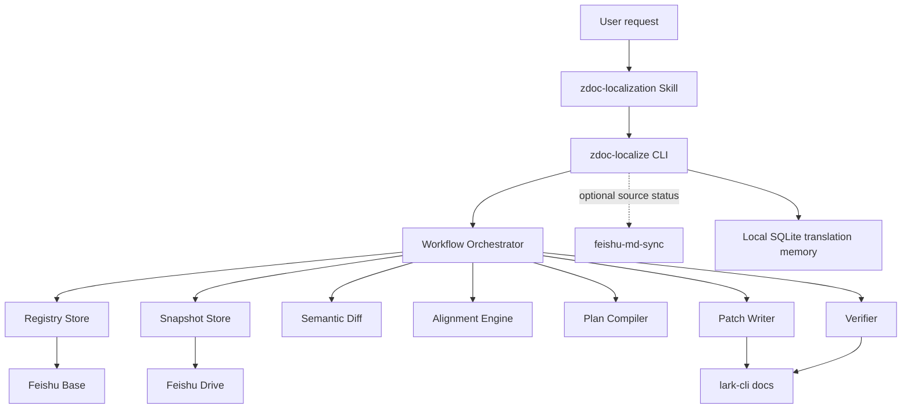
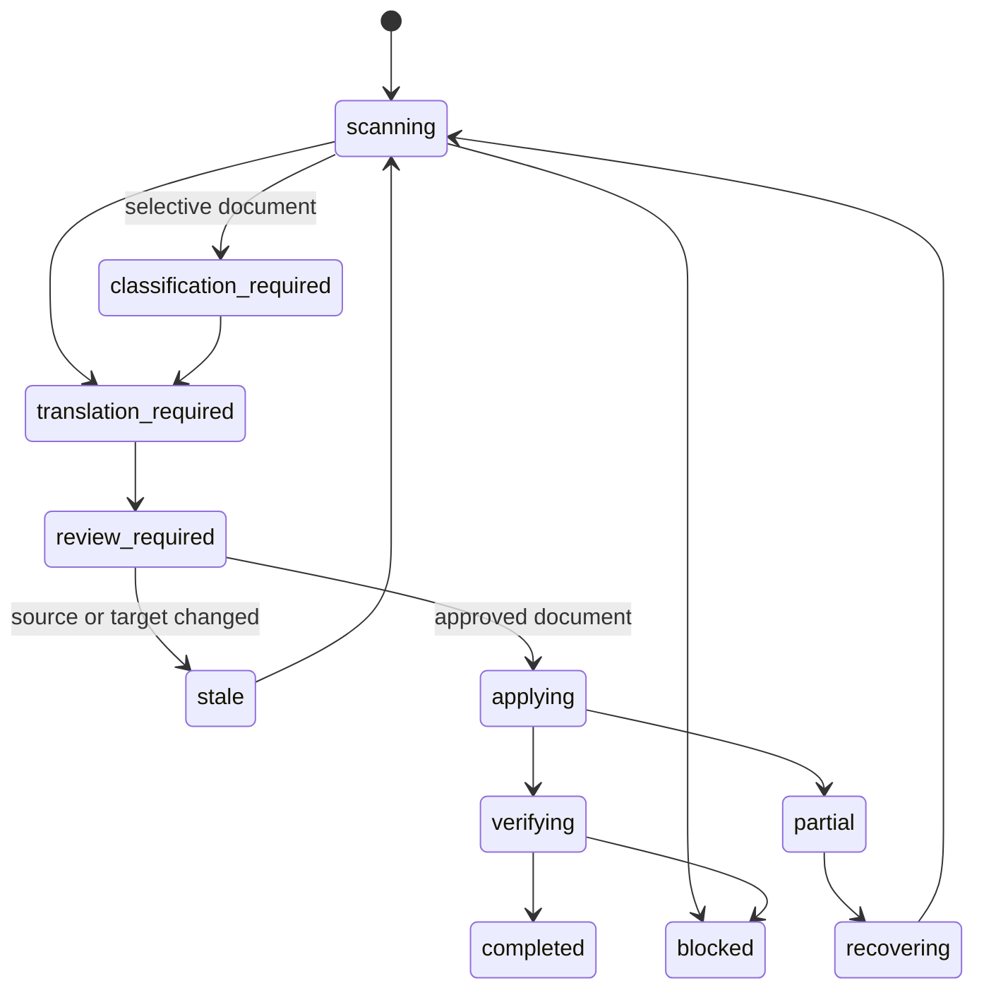

# ZDoc Localization Agent Design

## Status

Approved direction. The user delegated the remaining design decisions and authorized proceeding through implementation planning, implementation, and validation without additional design checkpoints.

## Problem

ZDoc documentation is authored as local English Markdown and published to Feishu with `feishu-md-sync`. After publication, the remote English Feishu document is the source-language source of truth because editors may continue changing it directly. The corresponding Chinese document also exists only in Feishu and may contain intentional localization differences and human edits.

The current workflow lacks a durable answer to two questions:

1. Which English version was the current Chinese document last synchronized against?
2. Which parts of the current English changes should be applied to which Chinese blocks without overwriting unrelated Chinese edits?

The system must solve these questions without introducing a Git-managed Chinese corpus and without round-tripping the entire Chinese document through Markdown on every update.

## Goals

- Detect English changes against the exact English baseline used by the last successful Chinese synchronization.
- Align changed English sections and blocks with the current remote Chinese document.
- Generate Chinese translations using a Codex Skill, approved terminology, translation memory, and full section context.
- Produce a document-level review artifact that the user can edit before any remote write.
- Apply approved changes as precise Feishu block operations rather than whole-document replacement.
- Preserve unrelated human edits and fail closed when either document changes during review.
- Maintain shared document mappings, policies, baselines, and run history without adding a new hosted database.
- Provide a deterministic, testable CLI under a conversational Codex Skill.
- Support future multi-user operation without changing the core workflow engine.

## Non-goals for the First Release

- Scheduled or event-driven automatic scans.
- Unattended writes to Chinese documents.
- Full automatic handling of complex tables, images containing text, Whiteboards, Sheets, Base embeds, or other resource blocks.
- Automatic translation of unregistered English documents.
- Automatic reverse synchronization of remote English edits into local English Markdown.
- A hosted web service, queue, or dedicated PostgreSQL database.
- Multiple target languages. The data model must remain language-aware, but the first release supports `zh-CN` only.

## Product Shape

The product has two independently versioned layers.

### `zdoc-localize` CLI

The CLI is the deterministic execution engine. It owns state transitions, remote reads, snapshotting, semantic diffing, alignment, plan construction, validation, writes, verification, receipts, and translation-memory updates.

It must never depend on natural-language interpretation for a state transition or remote write.

### `zdoc-localization` Codex Skill

The Skill is the conversational orchestration and safety layer. It converts user intent into CLI calls, generates translations for structured requests, presents review artifacts, waits for explicit document-level approval, and routes authentication, stale-plan, conflict, and recovery outcomes.

The Skill must not reimplement diffing, alignment, plan validation, or write logic already supplied by the CLI.

## Version and Compatibility Contract

- The CLI uses semantic versions beginning at `0.1.0`.
- The Skill has its own version beginning at `1.0.0`.
- The Skill declares an accepted CLI version range, initially `>=0.1.0 <0.2.0`.
- Every Skill run begins with `zdoc-localize --version` and `zdoc-localize capabilities --format json`.
- `capabilities` returns a stable schema version and supported commands/features.
- Additive JSON response fields are backward compatible patch releases.
- Removing or renaming commands, flags, error types, state values, or required JSON fields requires a CLI minor release while the CLI remains below `1.0.0`.
- A Skill that cannot prove compatibility stops and prints the exact supported range and upgrade command.
- Release validation tests the installed package, JSON schemas, command examples used by the Skill, and the compatibility range.

## Repository Layout

```text
packages/zdoc-localize/
  package.json
  src/
    cli/
    application/
    domain/
    adapters/
    storage/
    translation/
  test/
skills/zdoc-localization/
  SKILL.md
  references/
scripts/
  check-zdoc-localize-skill-compat.mjs
docs/superpowers/specs/
```

The package is included by the existing `packages/*` pnpm workspace pattern. The CLI package remains independent from Docusaurus so it can later move to a standalone repository without changing its command or storage contracts.

## Architecture



### Dependency Boundary with `feishu-md-sync`

`feishu-md-sync` remains responsible for publishing and reconciling local English Markdown with remote English Feishu. `zdoc-localize` may invoke its read-only status/diff commands during a combined publish-and-localize conversation, but localization correctness never depends on its local receipt.

The localization baseline is independent and always represents the remote English version against which the Chinese document was last successfully synchronized.

### Dependency Boundary with `lark-cli`

`lark-cli` supplies authentication and Feishu APIs:

- `docs +fetch` for remote content, block IDs, and revisions.
- `docs +update` for block-level Chinese changes.
- Base operations for shared registry and run state.
- Drive operations for immutable snapshots and review artifacts.
- Wiki/Drive creation operations for explicitly approved new Chinese documents.

Development uses `--as user`. Bot/service identity is deferred until multi-user automation.

## Core Components

### Workflow Orchestrator

Implements commands as explicit state transitions. It coordinates adapters but contains no Feishu-specific parsing or model prompting.

### Lark Process Adapter

Runs `lark-cli` with argument arrays, never shell interpolation. It suppresses update notices for machine-readable calls, parses the success/error envelope, preserves exit codes, and maps upstream failures into stable CLI errors.

### Feishu Markdown Sync Adapter

Optional read-only adapter for `feishu-md-sync status` and `diff`. It is not used to write Chinese documents.

### Registry Store

Stores document pairs, policies, glossary entries, successful localization receipts, and run summaries in Feishu Base.

### Snapshot Store

Stores immutable XML, semantic JSON, readable Markdown, review Markdown, and executable plan JSON under a machine-managed Feishu Drive folder. Base records store file tokens and SHA-256 hashes, not full document bodies.

### Semantic Document Parser

Converts Feishu XML into a canonical document tree independent of current block IDs. It preserves block IDs and remote resource tokens as runtime metadata while generating stable locators and fingerprints for diffing.

### Semantic Diff Engine

Compares the last successful English semantic snapshot with current remote English and emits typed changes: `insert`, `replace`, `delete`, and `move`.

### Alignment Engine

Maps English changes to current Chinese sections and blocks using heading paths, block kinds, sibling order, content fingerprints, previous correspondence, and semantic similarity.

### Translation Request Builder

Produces model-independent JSON requests containing old/new English, current Chinese, section context, applicable terminology, translation-memory examples, link mappings, preserved tokens, and localization scope.

### Plan Compiler

Validates Skill-generated translations and produces a protected JSON execution plan plus an editable Markdown review artifact.

### Patch Writer

Translates the approved plan into XML `block_replace`, `block_insert_after`, and `block_delete` operations. It never uses whole-document `overwrite` for an existing Chinese document.

### Verifier

Re-fetches affected sections and confirms final semantic content, terminology, links, preserved resources, and expected revision progression before committing a successful receipt.

## Shared Data Model

### `document_pairs`

| Field | Meaning |
|---|---|
| `pair_id` | Stable UUID |
| `source_locale` | `en` |
| `target_locale` | `zh-CN` |
| `source_doc_url` | English Feishu document/wiki URL |
| `source_doc_token` | Resolved English document token |
| `target_doc_url` | Chinese URL; empty before approved creation |
| `target_doc_token` | Resolved Chinese document token |
| `target_parent_url` | Approved Wiki/Drive parent for creation |
| `mode` | `mirror`, `selective`, `independent`, or `excluded` |
| `product_scope` | Optional product identifier |
| `version_scope` | Optional version identifier |
| `environment_scope` | Optional environment identifier |
| `status` | `active`, `needs_bootstrap`, `blocked`, or `disabled` |
| `last_source_revision` | English revision synchronized to Chinese |
| `last_source_hash` | Canonical English semantic hash |
| `last_source_snapshot_token` | Drive token for immutable baseline bundle |
| `last_successful_run_id` | Successful run UUID |

### `glossary`

| Field | Meaning |
|---|---|
| `term_id` | Stable UUID |
| `source_term` | English term |
| `target_term` | Approved Chinese term; empty for keep-as-is |
| `disposition` | `translate`, `keep_as_is`, or `deprecated` |
| `scope_type` | `global`, `product`, `environment`, `version`, or `document` |
| `scope_value` | Scope identifier |
| `prohibited_variants` | Disallowed Chinese variants |
| `status` | `candidate`, `approved`, or `deprecated` |
| `notes` | Human guidance and examples |
| `approved_by` | Reviewer identity |
| `updated_at` | Last modification time |

Resolution priority is document, product/environment/version, then global. Two approved entries at the same priority for the same term are a blocking configuration error.

### `localization_runs`

| Field | Meaning |
|---|---|
| `run_id` | Stable UUID |
| `pair_id` | Document pair |
| `state` | Workflow state |
| `created_by` | User identity |
| `source_from_revision` | Baseline revision |
| `source_to_revision` | Current English revision at planning |
| `target_plan_revision` | Chinese revision at planning |
| `request_bundle_token` | Translation request bundle |
| `review_bundle_token` | Review Markdown and plan bundle |
| `prewrite_target_snapshot_token` | Chinese rollback evidence |
| `risk_summary` | Structured risk counts |
| `error_type` | Stable failure type |
| `error_detail` | Diagnostic JSON |
| `reviewed_at` | Review completion time |
| `completed_at` | Successful verification time |

## Local Storage

### Translation Memory SQLite

The database is a performance and quality cache, not critical workflow state. It can be rebuilt from successful shared runs.

Each record stores:

- Source block canonical hash.
- Source and target locale.
- Glossary version hash.
- Heading-path context.
- Approved source text and target text.
- Pair/run provenance.
- Approval and success timestamps.

Exact reuse requires identical source hash, compatible context, and identical glossary hash. Similar matches are prompt examples only.

### Run Workspace

Default path:

```text
.zdoc-localize/runs/<run-id>/
  source-before.xml
  source-before.semantic.json
  source-current.xml
  source-current.semantic.json
  target-current.xml
  target-current.semantic.json
  translation-requests.json
  translations.json
  plan.json
  review.md
  apply-log.jsonl
  validation-report.json
```

The directory is ignored by Git. Shared Drive copies allow another machine to inspect or recover a run.

## Semantic Model and Locators

Remote documents are fetched as full XML with block IDs and `revision_id`. Markdown is never used as the write locator format.

The canonical tree contains sections and nodes such as paragraphs, headings, lists, callouts, quotes, code blocks, tables, and opaque resource blocks.

A stable locator combines:

- Normalized heading path.
- Node kind.
- Relative sibling position.
- Text fingerprint.
- Previous English-to-Chinese correspondence when available.

Block IDs are stored only as current remote write coordinates. A plan binds each target operation to both block ID and semantic hash.

Alignment confidence:

- `high`: unique heading-path and historical correspondence match.
- `medium`: structurally unique match with substantial localized text drift.
- `low`: missing section, multiple candidates, or structural conflict.

Low-confidence operations cannot enter an executable plan. Medium-confidence operations are highlighted in review.

## Supported Content

### First-release writable content

- Document title and headings.
- Paragraphs and rich inline text.
- Ordered and unordered lists.
- Quotes.
- Callouts whose children are supported text structures.

### Preserved and validated content

- Inline code and fenced code blocks.
- Commands, variables, API names, and product identifiers.
- External URLs and download URLs.
- User/document citations and resource tokens.

### Report-only content

- Complex tables.
- Images containing English text.
- Whiteboards.
- Sheets, Base embeds, synchronized references, and other opaque resource blocks.

An unsupported changed block prevents silent completion. The plan reports it and requires the document to be revised or the run to be marked blocked.

## Document Modes

- `mirror`: every supported English change is expected to produce a Chinese operation.
- `selective`: the Skill first classifies applicability with human review. Only confirmed applicable changes enter the final atomic plan.
- `independent`: diff and recommendations only; no executable plan.
- `excluded`: ignored by scans and cannot start a localization run.

The first release does not infer mode or applicability solely from model judgment.

## Translation Provider Protocol

The CLI does not call a model in the first release.

1. `plan create` emits `translation-requests.json` and state `translation_required`.
2. The Skill reads the requests and generates `translations.json` with the current Codex model.
3. `plan complete` validates the response and produces `plan.json` and `review.md`.

Each translation response is keyed by immutable operation ID. The CLI verifies:

- Every required operation has exactly one translation.
- No unknown operation IDs are present.
- Preserved placeholders, code, URLs, citations, and resource tokens remain intact.
- Approved terminology is used and prohibited variants are absent.
- Links are rewritten only through registered document-pair mappings.
- Structural tags match the target node kind.

A later `openai-compatible` provider may automate step 2 without changing request/response schemas.

## Review Artifact

Review is document-level. The final plan must account for every applicable supported English change, and all plan operations are applied together.

`review.md` displays for each operation:

- Operation type and risk.
- English before and after.
- Current Chinese.
- Editable proposed Chinese.
- Alignment confidence and warnings.

Only text between operation-specific editable markers may change. Operation topology, block IDs, hashes, and anchors remain in `plan.json`. `apply` rejects missing, duplicated, reordered, or malformed operation markers.

The user may edit any proposed Chinese. The edited, validated text is the only text written remotely and the only text added to translation memory.

## Workflow and Commands

### Diagnostics and setup

```text
zdoc-localize --version
zdoc-localize capabilities --format json
zdoc-localize doctor --format json
zdoc-localize init --registry <base-url> --state-folder <drive-folder-url>
```

### Pair management

```text
zdoc-localize pair add --source <url> --target <url> --mode <mode>
zdoc-localize pair list
zdoc-localize pair show --pair <id>
```

### Bootstrap

```text
zdoc-localize bootstrap plan --pair <id>
zdoc-localize bootstrap accept --run <id>
```

Bootstrap fetches current English and Chinese, aligns them, reports structural gaps, and requires explicit acceptance before recording the first baseline. It never retranslates or rewrites the document automatically.

### Localization

```text
zdoc-localize plan create --pair <id>
zdoc-localize plan complete --run <id> --translations <file>
zdoc-localize apply --run <id> --review <file>
zdoc-localize status --run <id>
```

### Recovery

```text
zdoc-localize recover inspect --run <id>
zdoc-localize recover reverse --run <id>
zdoc-localize recover accept-current --run <id>
```

`recover reverse` requires explicit high-risk confirmation after proving no unrelated concurrent edits. `accept-current` creates a new planning run from current remote state; it never marks the failed run successful.

## State Machine



A successful localization receipt is written only after `verifying -> completed`.

## Apply Safety

Before writing, the CLI:

1. Re-fetches source and target revision IDs.
2. Requires the source revision/hash to match the plan.
3. Requires every target block ID and semantic hash to match the plan.
4. Uploads a pre-write Chinese snapshot.
5. Validates all edited translations and compiles final XML.
6. Produces a write preview and requires explicit document-level approval.

Writes use `lark-cli docs +update` with XML and the planned revision. Existing documents never use `overwrite`.

- Combine all changes to the same block into one replacement.
- Batch safe deletions when supported.
- After replace, delete, insert, or move operations that may invalidate block IDs, re-fetch the affected section before continuing.
- Stop immediately on `partial_success`, revision mismatch, or unexpected block state.

Because Feishu does not provide a multi-block transaction, atomicity is logical rather than physical. Any partial write leaves the run in `partial`, does not update the receipt, and requires recovery.

## New Chinese Documents

When a registered English document has no target:

1. The Skill generates a complete local Chinese review draft.
2. The user reviews the whole document.
3. The CLI creates the document directly in the configured Chinese Wiki/Drive parent using the user identity.
4. The CLI re-fetches and verifies the new document.
5. It writes the target URL/token into `document_pairs` and records the first successful baseline.

The new Chinese document is not created through `feishu-md-sync`, because no long-lived local Chinese source will exist afterward.

## Link Localization

- External links remain unchanged.
- Internal English document links are rewritten to the registered Chinese target when one exists.
- Missing Chinese mappings preserve the English link and produce a review warning.
- Anchor links are resolved against actual Chinese block IDs; English anchors are never copied blindly.

## Error Model

Every command supports JSON output. Success is written to stdout with exit code `0`; failures are one JSON error envelope on stderr.

Stable error types include:

- `validation`
- `configuration`
- `authentication`
- `authorization`
- `not_found`
- `compatibility`
- `stale_plan`
- `alignment_blocked`
- `unsupported_content`
- `confirmation_required`
- `partial_write`
- `verification_failed`
- `upstream`
- `internal`

Exit codes:

- `2`: arguments or validation.
- `3`: authentication, authorization, or configuration.
- `4`: retryable upstream failure.
- `5`: verification or internal failure.
- `10`: explicit confirmation required.
- `1`: valid blocked workflow outcome, such as low-confidence alignment.

The Skill branches on exit code and structured fields, never human-readable message text.

## Authentication and Secrets

- Development commands use `lark-cli --as user`.
- `doctor` verifies `lark-cli` version, authenticated identity, required scopes, `feishu-md-sync` compatibility when requested, registry access, state-folder access, and local SQLite writability.
- The CLI never reads, prints, stores, or relocates App Secrets or access tokens.
- Authentication repair is delegated to the existing Lark shared authentication workflow.

## Testing Strategy

### Unit tests

- XML-to-semantic parsing and canonical hashes.
- Heading-path and locator stability.
- Insert/replace/delete/move diff classification.
- English-to-Chinese alignment confidence.
- Glossary scope resolution and conflict detection.
- Translation response validation.
- Review marker parsing and tamper detection.
- State transition legality.
- Error-envelope and exit-code mapping.

### Contract tests

- Mocked `lark-cli`, `feishu-md-sync`, Base, and Drive process responses.
- Command JSON schemas and backward compatibility fixtures.
- Skill command examples against the packaged CLI.
- Block ID invalidation and re-fetch behavior.
- Stale source and stale target rejection.
- Partial-write recovery evidence.

### Integration tests

- Temporary local registry/snapshot adapters exercise the complete workflow without Feishu.
- Optional live Feishu tests use dedicated test documents and must never run in the default test command.

### Validation fixtures

Pilot fixtures cover:

- Two structurally aligned mirror documents.
- One document with human Chinese edits.
- One selective version/environment document.
- One boundary document with code, links, tables, and opaque resource blocks.

## Release Process

1. Run type checking, unit tests, contract tests, package smoke tests, and Skill compatibility tests.
2. Build and pack the CLI.
3. Install the packed artifact into a clean temporary environment.
4. Run every command example referenced by the Skill against fixtures.
5. Publish the CLI package.
6. Publish/update the Skill only when its compatible range or workflow changes.

The Skill must stop with an upgrade instruction when the installed CLI is outside its supported range.

## First Implementation Slice

The first implementation delivers the complete deterministic offline core plus live adapter boundaries:

1. CLI packaging, capabilities, doctor, JSON envelopes, and compatibility checks.
2. Semantic document model, parser, diff, alignment, glossary resolution, review compiler, and state machine.
3. Local SQLite translation memory.
4. Process adapters for `lark-cli` and `feishu-md-sync` with mocked contract tests.
5. Base/Drive repository interfaces and command construction, configurable but not live-provisioned without user targets.
6. Bootstrap, plan, complete, apply-preview, stale checks, and verification orchestration.
7. Codex Skill with the CLI routing and approval policy.

Live creation of the user's Base, state folder, and writes to production documents requires explicit target URLs and authentication and is validated separately from local implementation completion.

## Success Criteria

The first release is successful when:

- A registered fixture document can be bootstrapped and accepted.
- A later English fixture change produces the expected semantic diff and translation requests.
- Skill-compatible translations compile into an editable document-level review artifact.
- Editing review text cannot alter operation topology.
- Stale English or Chinese content prevents apply.
- An approved plan produces only the expected block operations.
- Verification is required before a new receipt and translation-memory entries are committed.
- The CLI and Skill compatibility checks pass from a packed installation.
- The final validation report clearly separates automated local validation from any live Feishu validation not performed.
