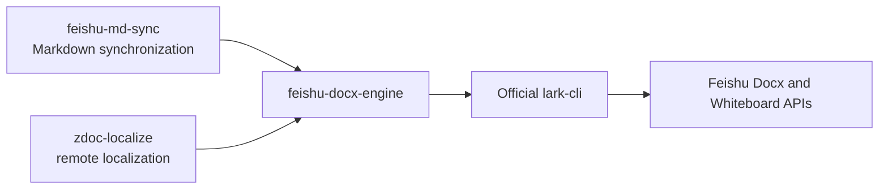
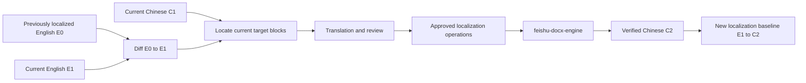

# Shared Feishu Docx Engine Design

## Status

Approved design. Implementation planning has not started.

## Context

ZDoc currently uses two independently published CLIs:

- `feishu-md-sync` synchronizes canonical local English Markdown with an English Feishu document.
- `zdoc-localize` compares remote English revisions, generates reviewed Chinese translations, and applies approved updates to a remote Chinese Feishu document.

Both CLIs use the official `lark-cli`, but they currently implement separate document adapters, semantic models, mutation execution, readback verification, and partial-write handling.

The divergence became visible during the Hugging Face localization dogfood. `feishu-md-sync 0.5.0` could represent and safely publish the English document containing a native table and nested list structure, while `zdoc-localize 0.1.1` rejected the same structures during initialization of an existing title-only Chinese target.

This is an architectural capability-drift problem. Adding another table and nested-list writer directly to `zdoc-localize` would duplicate the physical Feishu mutation logic and allow the two implementations to drift again.

## Decision

Keep `feishu-md-sync` and `zdoc-localize` in independent repositories with independent CLI versions, releases, workflow state, and receipts.

Extract a separately versioned and published npm package named `feishu-docx-engine` in the `feishu-md-sync` repository. Both CLIs depend on the published package.



The shared module owns how an approved Docx mutation is safely executed and proven. Each CLI continues to own why the mutation exists, what business approval is required, and what successful completion means.

## Goals

- Implement Feishu Docx mutation behavior once for both CLIs.
- Preserve independent repositories and release lifecycles for the two CLIs.
- Keep Markdown publishing concepts out of localization state.
- Keep translation, glossary, review, and correspondence concepts out of Markdown synchronization.
- Represent nested lists and native tables as typed structures instead of lossy Markdown or ad hoc XML strings.
- Centralize revision preflight, anchor verification, idempotency, readback, partial-write evidence, and recovery assessment.
- Preserve both products’ existing review, approval, receipt, and fail-closed safety gates.
- Allow `zdoc-localize` to initialize an existing title-only Chinese document containing nested lists and native tables.

## Non-goals

- Combining the two CLIs into one product.
- Sharing publish receipts and localization receipts.
- Making `zdoc-localize` invoke the `feishu-md-sync` CLI.
- Moving Markdown diffing, source dialects, link resolution policy, or ZDoc authoring round-trip policy into the shared module.
- Moving translation generation, glossary resolution, alignment, or human review into the shared module.
- Automatically creating native synced references while Feishu does not expose a supported creation operation.
- Bypassing existing document-level approval or partial-write recovery gates.

## Product Workflows

### English Markdown synchronization

`feishu-md-sync` owns this pipeline:

```text
Local English Markdown
  -> dialect and link processing
  -> local/remote semantic diff
  -> collaboration and protected-resource policy
  -> product publish preview and approval
  -> Docx mutation intents
  -> feishu-docx-engine
  -> publish receipt
```

Its baseline describes the relationship between local English Markdown and the remote English Feishu document.

### Incremental localization

`zdoc-localize` does not pull the Chinese document into a long-lived local Markdown source.

After a successful localization, it retains:

- the English source snapshot and revision used by the completed run;
- the completed Chinese revision and canonical hash;
- English-to-Chinese block correspondences;
- immutable run and recovery evidence.

For a later update:



English changes are determined by comparing `E0` with `E1`. The current Chinese document `C1` is used to locate targets, detect conflicting human edits, and preserve unrelated Chinese changes. It is not used as the source-language change baseline.

The expected conflict behavior is:

| English source | Corresponding Chinese | Result |
| --- | --- | --- |
| Changed | Unchanged | Generate a localization update |
| Unchanged | Changed | Preserve the Chinese human edit |
| Changed | Changed | Review or block as a potential conflict |
| Changed | Missing or ambiguous | Block instead of guessing |

## Shared Module Seam

The shared module is a deep module. It must not expose a shallow copy of every `lark-cli` command.

Its public interface is limited to document observation, physical plan preparation, execution, and recovery assessment:

```ts
interface FeishuDocxEngine {
  snapshot(document: DocumentSelector): Promise<DocumentSnapshot>;

  prepare(input: {
    snapshot: DocumentSnapshot;
    operations: MutationIntent[];
    idempotencyNamespace: string;
  }): PreparedMutationBatch;

  apply(input: {
    batch: PreparedMutationBatch;
    journal: MutationJournal;
  }): Promise<MutationOutcome>;

  assessRecovery(input: {
    batch: PreparedMutationBatch;
    checkpoint: MutationCheckpoint;
  }): Promise<RecoveryAssessment>;
}
```

The interface includes its invariants and error modes:

- `snapshot` returns a normalized typed block tree, current revision, canonical hashes, block IDs, parent/child relationships, and resource tokens.
- `prepare` is deterministic for the same snapshot, operations, engine version, and idempotency namespace.
- `apply` refetches the remote document and refuses to write if the reviewed revision, anchors, expected hashes, parents, or sibling relationships changed.
- every mutation is followed by exact readback before it is reported as verified;
- `assessRecovery` is read-only and never resumes, reverses, or accepts state by itself.

## Typed Document Model

The engine owns a provider-facing typed Docx model. It does not own either product’s higher-level semantic model.

Representative desired nodes are:

```ts
type DesiredNode =
  | ParagraphNode
  | HeadingNode
  | ListNode
  | TableNode
  | CodeNode
  | QuoteNode
  | CalloutNode;
```

The engine rejects unknown or unsupported provider structures instead of flattening them.

### Nested lists

Nested lists are represented as trees:

```ts
interface ListNode {
  kind: "list";
  ordered: boolean;
  items: Array<{
    content: InlineContent[];
    children: ListNode[];
  }>;
}
```

The engine creates roots and descendants explicitly through the Docx children API. It uses deterministic client tokens, verifies every returned block identity, and compares the final parent graph and sibling order with the prepared plan.

### Native tables

Tables retain row, cell, merge, and child-content structure:

```ts
interface TableNode {
  kind: "table";
  rows: Array<{
    cells: Array<{
      content: DesiredNode[];
    }>;
  }>;
}
```

The engine verifies the native table block type, placement anchors, dimensions, merge relationships, cell content, and returned block identities. Unsupported resources inside a cell block the operation before any write.

## Mutation Model

The physical operation union is product-neutral:

```ts
type MutationIntent =
  | ReplaceNode
  | InsertSubtree
  | DeleteSubtree
  | MoveSubtree
  | AssertNode
  | MirrorWhiteboard;
```

Every operation carries a stable caller-provided `operationId`. The engine may compile one operation into multiple provider calls, but the execution result maps all created block IDs and resource tokens back to the original operation ID.

`PreparedMutationBatch` contains:

- schema and engine versions;
- target document identity and expected revision;
- expected block hashes and identities;
- parent, preceding-anchor, following-anchor, and sibling assertions;
- compiled recursive child creation steps;
- deterministic idempotency tokens;
- per-operation readback assertions;
- a canonical batch fingerprint.

The two CLIs include this fingerprint in their own approval material. The engine does not implement human approval.

## Localization of Structured Content

`zdoc-localize` owns translation slots and protected structure.

For a nested list it creates stable text slots such as:

```text
list-1/item-1/text
list-1/item-2/text
list-1/item-2/child-1/text
```

For a table it creates stable cell-content slots such as:

```text
table-1/row-1/cell-1/paragraph-1
table-1/row-2/cell-3/paragraph-1
```

The translation provider may fill text slots but cannot change:

- list nesting or ordered/unordered type;
- list item count or ordering;
- table dimensions, merge relationships, or cell ordering;
- child block kinds;
- code, URLs, citations, commands, variables, or protected tokens.

`review.md` renders the whole list or table for human readability. `plan.json` stores the immutable structure and exact editable slots. Approved slots compile into `DesiredNode` trees before entering the shared engine.

Ordinary code is copied verbatim with language and caption metadata. Whiteboard mirror policy remains a localization decision, while raw physical creation, overwrite, and hash verification may be supplied by the engine. Native synced references remain a manual-action workflow until the provider supports creation.

## Safety and Partial Writes

The engine executes one reviewed operation at a time:

```text
refetch current document
  -> verify revision and physical preconditions
  -> execute one operation
  -> read back and verify the exact result
  -> persist verified evidence through the caller journal
  -> continue to the next operation
```

The caller injects durable storage through:

```ts
interface MutationJournal {
  recordVerified(evidence: VerifiedOperationEvidence): Promise<void>;
}
```

The engine does not choose the caller’s storage. `feishu-md-sync` writes publish checkpoints; `zdoc-localize` writes run evidence to its Base and Drive-backed state.

A partial result includes:

```ts
interface PartialMutationEvidence {
  batchFingerprint: string;
  beforeSnapshotHash: string;
  lastObservedRevision: string;
  completedOperations: VerifiedOperationEvidence[];
  failedOperation: MutationFailure;
  pendingOperationIds: string[];
  createdBlockIds: string[];
  recoveryDisposition:
    | "resume_possible"
    | "reverse_possible"
    | "manual_inspection_required";
}
```

A process may fail after the provider accepted a write but before the journal persisted it. Recovery assessment therefore uses deterministic idempotency tokens and current readback to prove an exact completed prefix, structured descendant identities, and an unchanged suffix. Any extra remote change, changed anchor, ambiguous graph, or content drift keeps recovery blocked.

The engine only reports recovery evidence. Resume, reverse, finalize, and accept-current remain product decisions and retain their existing user approval requirements.

## Ownership Boundaries

### `feishu-docx-engine` owns

- `lark-cli` process invocation for Docx and supported Whiteboard operations;
- structured success and error parsing;
- Wiki-to-Docx resolution;
- Docx block tree fetching and normalization;
- provider block codecs;
- physical mutation compilation;
- revision and anchor preflight;
- idempotent execution;
- operation-level readback;
- partial-write evidence;
- read-only recovery assessment.

### `feishu-md-sync` retains

- local Markdown parsing;
- source dialects and authoring transforms;
- link resolution policy;
- local/remote diff and publish strategy;
- collaboration and untracked-remote risk;
- Procedures, Supademo, Callout, Code, table, and Whiteboard product policy;
- publish preview and confirmation flags;
- publish receipt and baseline adoption.

### `zdoc-localize` retains

- pair registry and document modes;
- English baseline diff;
- Chinese alignment and correspondence;
- glossary and translation memory;
- translation requests and validation;
- review and approval tokens;
- Base run state and Drive snapshots;
- localization receipt;
- manual synced-reference verification.

`zdoc-localize` no longer invokes or checks the `feishu-md-sync` executable after adopting the shared package.

## Repository and Release Model

The source layout in the `feishu-md-sync` repository becomes:

```text
packages/
  docx-engine/
  cli/
```

The engine has its own package name, version, changelog, tests, and npm release. `feishu-md-sync` uses a workspace dependency during development. `zdoc-localize` consumes the published package through an explicit compatible version range.

Example independent versions:

```text
feishu-docx-engine 0.2.1
feishu-md-sync     0.6.0
zdoc-localize      0.2.0
```

No consumer uses a wildcard dependency. Prepared batches include a schema version and engine version. An incompatible engine refuses to execute a stored batch.

Both CLIs expose the embedded engine version and capabilities in diagnostics. `zdoc-localize doctor` removes the current optional `feishu-md-sync --version` probe and reports engine capabilities instead.

## Delivery Decomposition

The design spans two repositories, so implementation is split into two independently reviewable and releasable projects rather than one cross-repository change set.

### Project A: engine extraction and `feishu-md-sync` adoption

This project is implemented entirely in the `feishu-md-sync` repository. It creates and publishes `feishu-docx-engine`, routes existing publish execution through it, and proves that `feishu-md-sync` behavior and safety contracts have not regressed.

Project A is complete only after a packaged engine release and a released `feishu-md-sync` version consume the same engine package successfully.

### Project B: `zdoc-localize` adoption and structured localization

This project is implemented in the ZDoc repository after Project A publishes a compatible engine. It replaces the localization writer, adds typed list and table translation slots, preserves legacy recovery behavior, and completes the Hugging Face dogfood.

Project B must consume a released engine artifact rather than an unpublished cross-repository path or Git dependency. This keeps both repositories independently buildable and releasable.

## Migration Plan

### Phase 0: characterize existing behavior

Before moving code, add credential-free fixtures and characterization tests for:

- paragraphs, headings, quotes, Callouts, and Code;
- nested ordered and unordered lists;
- native table create and replace;
- Whiteboards;
- link encoding;
- scoped readback;
- partial-write evidence and recovery checkpoints.

The Hugging Face source structure supplies a regression fixture for the real nested list and parameter table that exposed the gap.

### Phase 1: extract without behavior change

Create `packages/docx-engine` in the `feishu-md-sync` repository and move the existing provider adapter, block model, codecs, structured-list creation, native-table rendering, retry logic, readback, and partial evidence behind the new interface.

The first extraction must not change `feishu-md-sync` CLI JSON, dry-run plans, confirmation requirements, or receipt format.

### Phase 2: route `feishu-md-sync` execution through the engine

Split the current publish orchestration into:

```text
publish planner
  -> product-neutral mutation intents
  -> feishu-docx-engine
  -> publish receipt coordinator
```

Release the engine only after the full `feishu-md-sync` suite, packaged smoke tests, and controlled live tests show no behavioral regression.

### Phase 3: integrate `zdoc-localize`

Add the published engine dependency and retire:

- the direct document-writing `LarkDocsAdapter`;
- the unused `FeishuMdSyncAdapter`;
- localization-side physical XML writer logic;
- duplicated physical progression verification;
- duplicated Whiteboard provider mutation code after engine parity exists.

The Base, Drive, translation, review, alignment, correspondence, and product recovery modules remain in `zdoc-localize`.

### Phase 4: enable structured initialization

Add list and table translation slots, review rendering, correspondence updates, preview output, and recovery handling. New initialization plans use the engine batch schema.

Create a fresh Hugging Face localization run from the current English revision. Do not reuse either obsolete run.

## Legacy State Compatibility

Completed localization receipts remain valid and require no new bootstrap.

Legacy `blocked`, `review_required`, or `stale` runs cannot be applied across an incompatible engine plan schema. The user creates a fresh run.

Legacy `partial` and `manual_action_required` runs are not silently converted. A compatibility recovery reader remains available to finish the original recovery or manual verification. New planning starts only after the unresolved legacy state is safely concluded.

For the current Hugging Face pair:

- run `fed0d0ad-da2b-4856-a9f6-b0e6a6b92501` remains obsolete because it targets English revision 31;
- run `f60a5974-07b4-46ed-8f09-df02143ea2e2` remains a recorded unsupported-content blocker;
- neither run is modified or applied;
- a fresh run is created after the new engine-backed capability is released.

## Testing Strategy

### Engine interface tests

Test observable behavior through the public engine interface with an injected fake `LarkCliExecutor`. Tests assert snapshots, prepared fingerprints, outcomes, structured errors, and recovery assessments rather than private helpers.

### Provider codec tests

Use realistic Docx block fixtures for nested lists, tables, code metadata, Callouts, Whiteboards, and unknown blocks. Unknown provider shapes fail closed.

### Consumer compatibility tests

`feishu-md-sync` preserves existing dry-run JSON, approval flags, receipt formats, and recovery behavior. `zdoc-localize` preserves review, approval, Base state, Drive snapshot, and receipt contracts except for explicitly versioned additive capabilities.

### Packaged cross-repository tests

CI packs the engine tarball and installs that artifact into consumer test jobs. Workspace links alone are insufficient because they do not prove package exports and runtime files are correct.

### Live dogfood

The Hugging Face workflow is the final acceptance dogfood:

1. confirm the English Feishu document is synchronized;
2. create a fresh localization plan;
3. verify complete nested-list and table translation requests;
4. present the complete review and warnings;
5. obtain review approval;
6. generate the exact apply preview and approval token;
7. obtain separate preview approval;
8. apply the Chinese write;
9. read back and verify the Docx block tree;
10. confirm completed state and updated localization receipt.

No remote write occurs during extraction, unit testing, or dry-run validation.

## Acceptance Criteria

- The two CLIs remain independently versioned and published from separate repositories.
- `feishu-docx-engine` is an independently versioned public package maintained in the `feishu-md-sync` repository.
- Both CLIs use the engine for supported Docx document mutations.
- `zdoc-localize` does not invoke the `feishu-md-sync` CLI.
- The products do not share business receipts or state machines.
- Nested-list and native-table mutation logic exists in one implementation.
- Engine outcomes expose exact created block identities, resource tokens, readback evidence, and partial-write state.
- Existing `feishu-md-sync` behavior and safety contracts do not regress during extraction.
- Existing completed localization receipts continue to work.
- A fresh Hugging Face localization run can produce a complete review for the existing title-only Chinese target.
- Chinese writes still require separate approval of the localization review and the exact apply preview.
- Successful completion requires final remote readback and persisted localization receipt.
